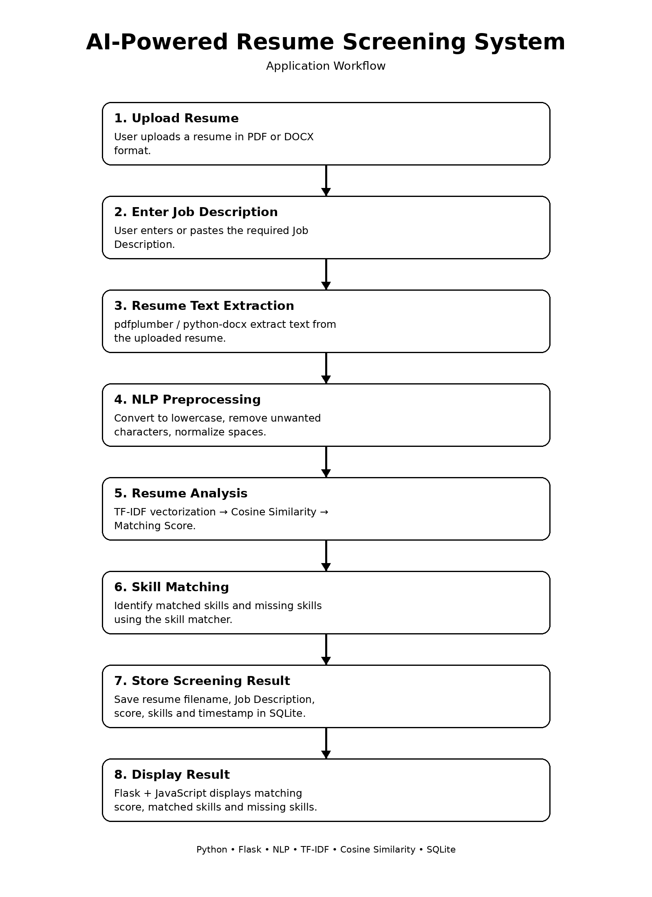

# 🤖 AI-Powered Resume Screening System

An AI-powered web application that automates the initial screening of resumes by comparing a candidate's resume with a given Job Description.

The system extracts resume text, processes it using Natural Language Processing (NLP), calculates a resume-job matching score using **TF-IDF and Cosine Similarity**, identifies **matched and missing skills**, and stores the screening results in an **SQLite database**.

---

## 📌 Project Overview

Recruiters often receive a large number of resumes for a single job opening. Manually reviewing every resume and comparing it with the job requirements can be time-consuming.

This project provides an automated **first-level resume screening system** that helps users quickly understand how closely a resume matches a particular job description.

The application allows the user to:

- Upload a resume in PDF or DOCX format
- Enter a Job Description
- Extract resume text automatically
- Calculate a resume-job matching score
- Identify matched technical skills
- Identify missing technical skills
- Store screening results in SQLite
- View the results through a web interface

> **Note:** This application is designed as an initial screening and decision-support tool. The matching score should not be treated as a final hiring decision.

---

## 🎯 Problem Statement

Traditional resume screening requires recruiters to manually compare candidate resumes with job descriptions.

This process can be:

- Time-consuming
- Repetitive
- Difficult to scale
- Prone to missing relevant skills

The goal of this project is to automate the initial screening process using **Python, NLP, Machine Learning techniques, and Flask**.

---

## 💡 Proposed Solution

The system compares the content of a resume with a Job Description using NLP-based text similarity.

It performs the following:

1. Resume text extraction
2. Text preprocessing
3. TF-IDF vectorization
4. Cosine Similarity calculation
5. Matching score generation
6. Skill extraction
7. Matched skill detection
8. Missing skill detection
9. SQLite result storage
10. Result display through Flask web application

---

## ✨ Key Features

- 📄 PDF resume parsing
- 📝 DOCX resume parsing
- 🔍 Automatic text extraction
- 🧹 NLP text preprocessing
- 📊 TF-IDF vectorization
- 📐 Cosine Similarity
- 🎯 Resume-job matching score
- 🧠 Technical skill matching
- ✅ Matched skills detection
- ❌ Missing skills detection
- 💾 SQLite database integration
- 🌐 Flask web application
- ⚡ Dynamic result display using JavaScript
- 🧪 Module-level testing
- 🔧 Git and GitHub integration

---

# 🔄 Application Workflow

The complete application workflow is represented in the flowchart below.

<!-- Add your flowchart image here -->



> Replace `flowchart.png` with the actual filename/path of your flowchart image if required.

---

# ⚙️ How It Works

### Step 1 — Upload Resume

The user uploads a resume in either:

- PDF
- DOCX

format.

---

### Step 2 — Enter Job Description

The user pastes the required Job Description into the web form.

---

### Step 3 — Resume Text Extraction

The Resume Parser extracts text from the uploaded resume.

Libraries used:

- `pdfplumber`
- `python-docx`

---

### Step 4 — Text Preprocessing

The extracted resume text and Job Description are cleaned before analysis.

The system:

- Converts text to lowercase
- Removes unwanted special characters
- Normalizes extra spaces

---

### Step 5 — TF-IDF Vectorization

The resume and Job Description are converted into numerical vectors using **TF-IDF (Term Frequency-Inverse Document Frequency)**.

---

### Step 6 — Cosine Similarity

Cosine Similarity is calculated between the resume and Job Description vectors.

The similarity value is converted into a percentage:

```text
Matching Score = Cosine Similarity × 100
```

Example:

```text
Cosine Similarity = 0.4216

Matching Score = 42.16%
```

---

### Step 7 — Skill Matching

The system extracts technical skills from both the resume and Job Description.

It identifies:

**Matched Skills**

Skills present in both the resume and Job Description.

**Missing Skills**

Skills required by the Job Description but not found in the resume.

---

### Step 8 — Store Result

The screening result is stored in an SQLite database.

Stored information includes:

- Resume filename
- Job Description
- Matching score
- Matched skills
- Missing skills
- Timestamp

---

### Step 9 — Display Result

The result is displayed on the web interface using JavaScript without requiring a full page reload.

---

# 🛠️ Technology Stack

| Category | Technologies |
|---|---|
| Programming Language | Python 3.12 |
| Backend | Flask |
| NLP / ML | Scikit-learn |
| Text Vectorization | TF-IDF |
| Similarity | Cosine Similarity |
| Resume Parsing | pdfplumber, python-docx |
| Frontend | HTML5, CSS3, JavaScript |
| Database | SQLite |
| Version Control | Git, GitHub |
| IDE | Visual Studio Code |

---

# 📂 Project Structure

```text
AI-Resume-Screening-System/
│
├── app/
│   ├── __init__.py
│   ├── database.py
│   ├── routes.py
│   │
│   └── utils/
│       ├── resume_parser.py
│       ├── nlp_processor.py
│       └── matcher.py
│
├── templates/
│   └── index.html
│
├── static/
│
├── uploads/
│
├── run.py
├── requirements.txt
├── .gitignore
├── README.md
│
├── test_parser.py
├── test_nlp.py
├── test_matcher.py
├── test_analysis.py
└── test_database.py
```

---

# 🧩 Project Modules

## 1. Resume Parser

**File:**

```text
app/utils/resume_parser.py
```

Responsible for extracting text from PDF and DOCX resumes.

### Supported Formats

- PDF
- DOCX

### Libraries

- pdfplumber
- python-docx

---

## 2. NLP Processor

**File:**

```text
app/utils/nlp_processor.py
```

Responsible for:

- Text cleaning
- TF-IDF vectorization
- Cosine Similarity
- Matching score calculation

---

## 3. Skill Matcher

**File:**

```text
app/utils/matcher.py
```

Responsible for:

- Skill extraction
- Matched skill detection
- Missing skill detection

The current predefined skill list includes technologies such as:

```text
Python
Java
C++
SQL
Machine Learning
Deep Learning
NLP
Generative AI
RAG
Pandas
NumPy
Scikit-learn
TensorFlow
PyTorch
Keras
OpenCV
Computer Vision
Flask
FastAPI
Django
REST API
Git
GitHub
Docker
AWS
Azure
Power BI
Tableau
```

---

## 4. Database

**File:**

```text
app/database.py
```

SQLite is used to store screening results.

The database stores:

- ID
- Resume filename
- Job Description
- Matching score
- Matched skills
- Missing skills
- Created timestamp

---

## 5. Flask Routes

**File:**

```text
app/routes.py
```

### Home

```text
GET /
```

Displays the resume screening interface.

### Analyze

```text
POST /analyze
```

Processes the resume and Job Description and returns the screening result.

### Results

```text
GET /results
```

Retrieves stored screening results from SQLite.

---

# 🖥️ User Interface

The web interface provides:

- Resume upload field
- Job Description input
- Analyze Resume button
- Matching score
- Matched skills
- Missing skills

The frontend uses JavaScript Fetch API to communicate with the Flask backend.

---

# 📊 Sample Input

### Job Description

```text
We are looking for a Junior AI Engineer with experience in
Python, Machine Learning, NLP, Generative AI, Pandas,
NumPy, Scikit-learn and Flask.

Knowledge of TensorFlow, PyTorch and Docker is preferred.
```

---

# 📈 Sample Output

```text
Matching Score: 42.16%

Matched Skills:
- Python
- Machine Learning
- NLP
- Generative AI
- Pandas
- NumPy
- Scikit-learn
- Flask

Missing Skills:
- TensorFlow
- PyTorch
- Docker
```

> The matching score can vary depending on the resume and Job Description.

---

# 🧪 Testing

The project includes separate test files for the major components.

## Resume Parser Test

```bash
python test_parser.py
```

Tests PDF/DOCX text extraction.

---

## NLP Test

```bash
python test_nlp.py
```

Tests:

- Text cleaning
- TF-IDF
- Cosine Similarity
- Matching score

---

## Skill Matcher Test

```bash
python test_matcher.py
```

Tests:

- Skill extraction
- Matched skills
- Missing skills

---

## Complete Analysis Test

```bash
python test_analysis.py
```

Tests the complete resume analysis process.

---

## Database Test

```bash
python test_database.py
```

Tests:

- SQLite database creation
- Data insertion
- Database operations

---

# ⚙️ Installation

## Prerequisites

Make sure the following are installed:

- Python 3.12
- Git
- Visual Studio Code

---

## 1. Clone Repository

```bash
git clone https://github.com/bharati1802/AI-Resume-Screening-System.git
```

---

## 2. Navigate to Project

```bash
cd AI-Resume-Screening-System
```

---

## 3. Create Virtual Environment

```bash
python -m venv venv
```

---

## 4. Activate Virtual Environment

### Windows

```bash
venv\Scripts\activate
```

### macOS / Linux

```bash
source venv/bin/activate
```

---

## 5. Install Dependencies

```bash
pip install -r requirements.txt
```

---

# ▶️ How to Run

Start the Flask application:

```bash
python run.py
```

The application will run at:

```text
http://127.0.0.1:5000/
```

Open the URL in a web browser.

---

# 🧠 Concepts Demonstrated

This project demonstrates practical knowledge of:

### Python

- Functions
- Modules
- File handling
- Lists
- Dictionaries
- Exception handling
- Regular Expressions

### Flask

- Flask application
- Routes
- GET and POST requests
- File upload handling
- JSON responses
- HTML templates

### NLP / Machine Learning

- Text preprocessing
- TF-IDF
- Vectorization
- Cosine Similarity
- Text similarity
- Skill matching

### Database

- SQLite
- SQL queries
- INSERT
- SELECT
- Database connections

### Frontend

- HTML
- CSS
- JavaScript
- Forms
- Fetch API
- Dynamic DOM updates

### Version Control

- Git
- GitHub
- Branches
- Commits
- Remote repositories

---

# ⚠️ Limitations

The current version has some limitations:

- Uses a predefined technical skill list.
- TF-IDF is based on textual similarity.
- It does not provide deep semantic understanding.
- Scanned/image-based PDFs may require OCR.
- Matching score should not be the only factor in recruitment.
- The application is designed for initial screening.

---

# 🚀 Future Enhancements

Possible future improvements include:

- Semantic similarity using Sentence Transformers
- BERT-based resume matching
- Automatic skill extraction
- Named Entity Recognition
- Experience extraction
- Education extraction
- Candidate ranking
- Multiple resume screening
- Recruiter dashboard
- Authentication and authorization
- Resume improvement suggestions
- Job recommendation system
- OCR support
- Downloadable screening reports
- Data visualization
- Cloud deployment
- Production database integration

---

# 📌 Project Status

**Completed**

Current implementation includes:

- Resume upload
- PDF/DOCX text extraction
- NLP preprocessing
- TF-IDF
- Cosine Similarity
- Matching score
- Skill matching
- Missing skill detection
- SQLite database
- Flask backend
- Web interface
- Dynamic result display
- Unit/module testing

---

# 🔐 Privacy & Security

Resumes may contain personal information.

For production deployment, additional security measures should be implemented, including:

- Secure file storage
- Authentication
- Authorization
- File size validation
- File type validation
- HTTPS
- Secure database configuration
- Data encryption
- Automatic deletion of uploaded resumes

---

# 👩‍💻 Author

## Bharati Patil

BCA Graduate | MCA Student | Python | AI/ML | NLP | Generative AI

### GitHub

https://github.com/bharati1802

---

# 🔗 Project Repository

https://github.com/bharati1802/AI-Resume-Screening-System

---

# 📄 License

This project was developed for educational, portfolio, and demonstration purposes.